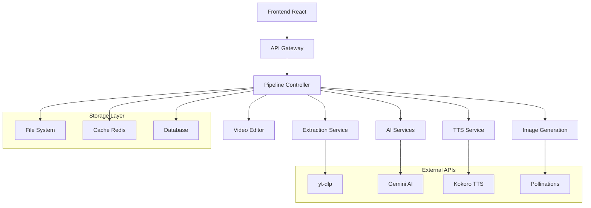
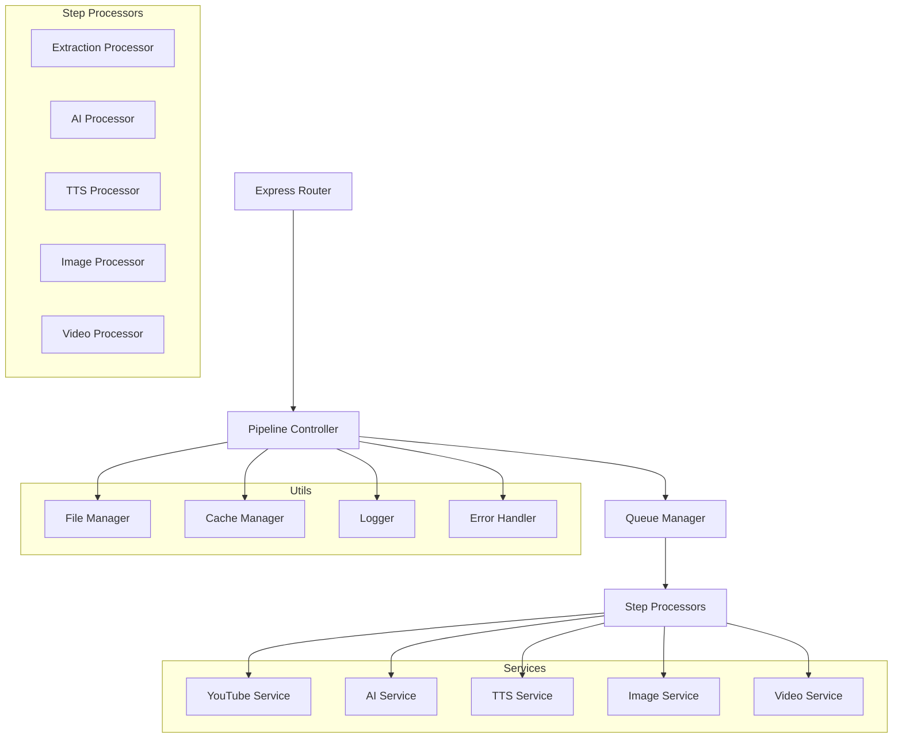
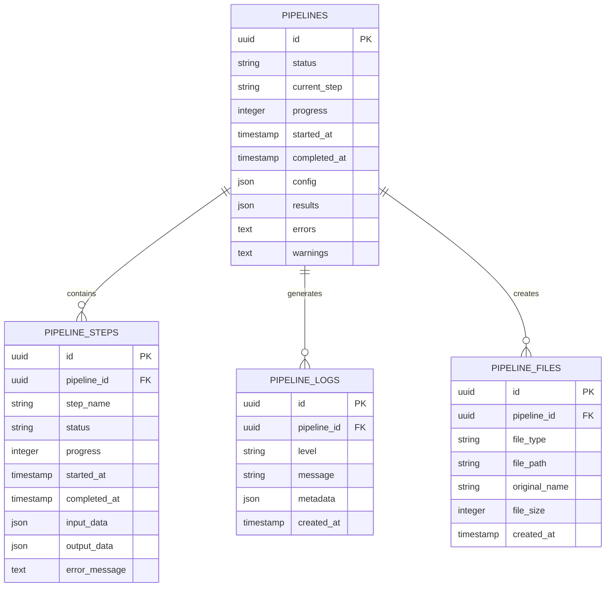
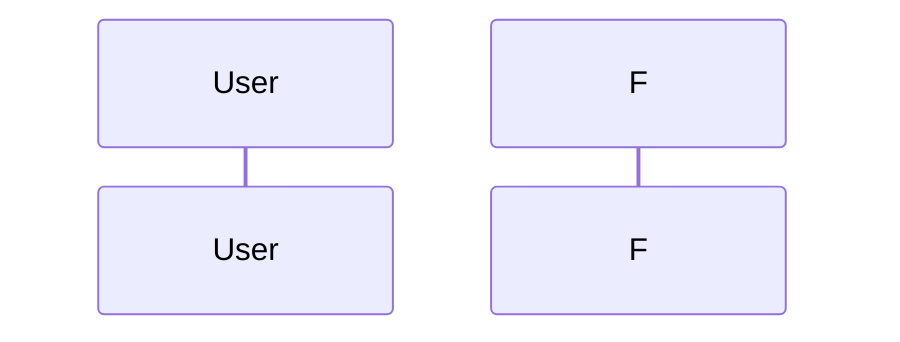

# 🏗️ Arquitetura Técnica - Pipeline de Automação Completa

## 1. Arquitetura Geral do Sistema



## 2. Estrutura de Tecnologias

### 2.1 Stack Principal

* **Frontend:** React 18 + Vite + TailwindCSS

* **Backend:** Express.js + Node.js

* **Database:** Supabase (PostgreSQL)

* **Cache:** Redis (opcional)

* **File Storage:** Sistema de arquivos local

* **Video Processing:** MoviePy (Python subprocess)

### 2.2 APIs Externas

* **YouTube Extraction:** yt-dlp (local)

* **AI Provider:** Google Gemini 1.5 Flash

* **TTS Provider:** Kokoro TTS

* **Image Generation:** Pollinations.ai

* **Fallback AI:** OpenAI GPT-4 (opcional)

## 3. Definições de Rotas

### 3.1 Rotas Frontend

| Rota                    | Propósito                    | Componente               |
| ----------------------- | ---------------------------- | ------------------------ |
| `/pipeline`             | Página principal do pipeline | `Pipeline.jsx`           |
| `/pipeline/automation`  | Automação completa           | `AutomationComplete.jsx` |
| `/pipeline/monitor/:id` | Monitoramento de pipeline    | `PipelineMonitor.jsx`    |
| `/pipeline/results/:id` | Resultados e download        | `PipelineResults.jsx`    |

### 3.2 Rotas Backend API

| Método | Endpoint                     | Propósito                   |
| ------ | ---------------------------- | --------------------------- |
| POST   | `/api/pipeline/complete`     | Iniciar automação completa  |
| GET    | `/api/pipeline/status/:id`   | Status do pipeline          |
| GET    | `/api/pipeline/logs/:id`     | Logs em tempo real          |
| POST   | `/api/pipeline/pause/:id`    | Pausar pipeline             |
| POST   | `/api/pipeline/cancel/:id`   | Cancelar pipeline           |
| GET    | `/api/pipeline/download/:id` | Download do vídeo           |
| DELETE | `/api/pipeline/cleanup/:id`  | Limpar arquivos temporários |

## 4. Definições de API Detalhadas

### 4.1 API Principal - Automação Completa

**`POST /api/pipeline/complete`**

**Request Body:**

```typescript
interface AutomationRequest {
  channel_url: string;
  config: {
    extraction: {
      method: 'ytdlp' | 'rapidapi' | 'auto';
      max_titles: number;
      min_views: number;
      days_back: number;
    };
    titles: {
      provider: 'gemini' | 'openai';
      custom_prompt: boolean;
      count: number;
      style: 'viral' | 'educational' | 'entertainment';
    };
    premises: {
      provider: 'gemini' | 'openai';
      custom_prompt: boolean;
      word_count: number;
    };
    scripts: {
      chapters: number;
      style: 'storytelling' | 'educational' | 'review';
      duration_target: string;
      include_hooks: boolean;
    };
    tts: {
      provider: 'kokoro' | 'elevenlabs' | 'google';
      voice: string;
      speed: number;
      emotion: string;
    };
    images: {
      provider: 'pollinations' | 'together' | 'dalle';
      style: 'cinematic' | 'realistic' | 'artistic';
      resolution: '1920x1080' | '1280x720';
      per_chapter: number;
    };
    video: {
      resolution: '1920x1080' | '1280x720';
      fps: 30 | 60;
      quality: 'high' | 'medium' | 'low';
      transitions: boolean;
      subtitles: boolean;
    };
  };
  api_keys: {
    gemini?: string;
    openai?: string;
    kokoro?: string;
    elevenlabs?: string;
  };
}
```

**Response:**

```typescript
interface AutomationResponse {
  success: boolean;
  pipeline_id: string;
  status: 'queued' | 'processing' | 'completed' | 'failed';
  estimated_time: string;
  steps: PipelineStep[];
  message: string;
}

interface PipelineStep {
  step: string;
  status: 'pending' | 'processing' | 'completed' | 'failed';
  progress: number;
  duration?: string;
  error?: string;
}
```

### 4.2 API de Status e Monitoramento

**`GET /api/pipeline/status/:id`**

**Response:**

```typescript
interface PipelineStatus {
  pipeline_id: string;
  status: 'queued' | 'processing' | 'completed' | 'failed' | 'paused';
  current_step: string;
  progress: number;
  started_at: string;
  estimated_completion?: string;
  completed_at?: string;
  steps: PipelineStep[];
  results: {
    extraction?: ExtractionResult;
    titles?: TitlesResult;
    premises?: PremisesResult;
    scripts?: ScriptsResult;
    tts?: TTSResult;
    images?: ImagesResult;
    video?: VideoResult;
  };
  errors: string[];
  warnings: string[];
}
```

### 4.3 Tipos de Dados Específicos

```typescript
interface ExtractionResult {
  videos: {
    title: string;
    views: number;
    duration: string;
    description: string;
    thumbnail: string;
    url: string;
  }[];
  channel_info: {
    name: string;
    subscribers: number;
    description: string;
  };
}

interface TitlesResult {
  original_titles: string[];
  generated_titles: string[];
  selected_title: string;
  niche_detected: string;
}

interface PremisesResult {
  premises: {
    title: string;
    premise: string;
    word_count: number;
  }[];
  selected_premise: string;
}

interface ScriptsResult {
  chapters: {
    title: string;
    content: string;
    duration: number;
  }[];
  total_duration: number;
  word_count: number;
}

interface TTSResult {
  audio_files: {
    chapter: number;
    file_path: string;
    duration: number;
  }[];
  total_duration: number;
  voice_used: string;
}

interface ImagesResult {
  images: {
    chapter: number;
    prompt: string;
    file_path: string;
    style: string;
  }[];
  total_images: number;
}

interface VideoResult {
  file_path: string;
  thumbnail: string;
  duration: string;
  size: string;
  resolution: string;
  fps: number;
}
```

## 5. Arquitetura do Servidor



## 6. Modelo de Dados

### 6.1 Diagrama ER



### 6.2 DDL (Data Definition Language)

```sql
-- Tabela principal de pipelines
CREATE TABLE pipelines (
    id UUID PRIMARY KEY DEFAULT gen_random_uuid(),
    status VARCHAR(20) NOT NULL DEFAULT 'queued',
    current_step VARCHAR(50),
    progress INTEGER DEFAULT 0,
    started_at TIMESTAMP WITH TIME ZONE DEFAULT NOW(),
    completed_at TIMESTAMP WITH TIME ZONE,
    config JSONB NOT NULL,
    results JSONB DEFAULT '{}',
    errors TEXT[],
    warnings TEXT[],
    created_at TIMESTAMP WITH TIME ZONE DEFAULT NOW(),
    updated_at TIMESTAMP WITH TIME ZONE DEFAULT NOW()
);

-- Tabela de etapas do pipeline
CREATE TABLE pipeline_steps (
    id UUID PRIMARY KEY DEFAULT gen_random_uuid(),
    pipeline_id UUID NOT NULL REFERENCES pipelines(id) ON DELETE CASCADE,
    step_name VARCHAR(50) NOT NULL,
    status VARCHAR(20) NOT NULL DEFAULT 'pending',
    progress INTEGER DEFAULT 0,
    started_at TIMESTAMP WITH TIME ZONE,
    completed_at TIMESTAMP WITH TIME ZONE,
    input_data JSONB,
    output_data JSONB,
    error_message TEXT,
    created_at TIMESTAMP WITH TIME ZONE DEFAULT NOW()
);

-- Tabela de logs do pipeline
CREATE TABLE pipeline_logs (
    id UUID PRIMARY KEY DEFAULT gen_random_uuid(),
    pipeline_id UUID NOT NULL REFERENCES pipelines(id) ON DELETE CASCADE,
    level VARCHAR(10) NOT NULL,
    message TEXT NOT NULL,
    metadata JSONB,
    created_at TIMESTAMP WITH TIME ZONE DEFAULT NOW()
);

-- Tabela de arquivos gerados
CREATE TABLE pipeline_files (
    id UUID PRIMARY KEY DEFAULT gen_random_uuid(),
    pipeline_id UUID NOT NULL REFERENCES pipelines(id) ON DELETE CASCADE,
    file_type VARCHAR(20) NOT NULL,
    file_path TEXT NOT NULL,
    original_name VARCHAR(255),
    file_size BIGINT,
    created_at TIMESTAMP WITH TIME ZONE DEFAULT NOW()
);

-- Índices para performance
CREATE INDEX idx_pipelines_status ON pipelines(status);
CREATE INDEX idx_pipelines_created_at ON pipelines(created_at DESC);
CREATE INDEX idx_pipeline_steps_pipeline_id ON pipeline_steps(pipeline_id);
CREATE INDEX idx_pipeline_logs_pipeline_id ON pipeline_logs(pipeline_id);
CREATE INDEX idx_pipeline_logs_created_at ON pipeline_logs(created_at DESC);
CREATE INDEX idx_pipeline_files_pipeline_id ON pipeline_files(pipeline_id);

-- Permissões Supabase
GRANT SELECT ON pipelines TO anon;
GRANT ALL PRIVILEGES ON pipelines TO authenticated;
GRANT SELECT ON pipeline_steps TO anon;
GRANT ALL PRIVILEGES ON pipeline_steps TO authenticated;
GRANT SELECT ON pipeline_logs TO anon;
GRANT ALL PRIVILEGES ON pipeline_logs TO authenticated;
GRANT SELECT ON pipeline_files TO anon;
GRANT ALL PRIVILEGES ON pipeline_files TO authenticated;

-- Dados iniciais para teste
INSERT INTO pipelines (config) VALUES 
('{
  "channel_url": "https://youtube.com/@example",
  "extraction": {"method": "ytdlp", "max_titles": 5},
  "titles": {"provider": "gemini", "count": 3},
  "video": {"resolution": "1920x1080", "fps": 30}
}');
```

## 7. Estrutura de Arquivos Backend

```
backend/
├── routes/
│   ├── pipeline.js              # Rotas principais do pipeline
│   └── pipeline-monitor.js      # Rotas de monitoramento
├── services/
│   ├── PipelineService.js       # Orquestrador principal
│   ├── ExtractionService.js     # Serviço de extração YouTube
│   ├── AIService.js             # Serviços de IA (Gemini/OpenAI)
│   ├── TTSService.js            # Serviço Text-to-Speech
│   ├── ImageService.js          # Serviço de geração de imagens
│   └── VideoService.js          # Serviço de edição de vídeo
├── processors/
│   ├── BaseProcessor.js         # Classe base para processadores
│   ├── ExtractionProcessor.js   # Processador de extração
│   ├── TitlesProcessor.js       # Processador de títulos
│   ├── PremisesProcessor.js     # Processador de premissas
│   ├── ScriptsProcessor.js      # Processador de roteiros
│   ├── TTSProcessor.js          # Processador de TTS
│   ├── ImagesProcessor.js       # Processador de imagens
│   └── VideoProcessor.js        # Processador de vídeo
├── utils/
│   ├── FileManager.js           # Gerenciamento de arquivos
│   ├── CacheManager.js          # Gerenciamento de cache
│   ├── Logger.js                # Sistema de logs
│   ├── ErrorHandler.js          # Tratamento de erros
│   └── QueueManager.js          # Gerenciamento de filas
├── models/
│   ├── Pipeline.js              # Modelo de pipeline
│   ├── PipelineStep.js          # Modelo de etapa
│   └── PipelineLog.js           # Modelo de log
└── config/
    ├── pipeline.js              # Configurações do pipeline
    ├── apis.js                  # Configurações de APIs
    └── storage.js               # Configurações de armazenamento
```

## 8. Estrutura de Arquivos Frontend

```
frontend/src/
├── pages/
│   ├── Pipeline.jsx             # Página principal (atualizada)
│   ├── AutomationComplete.jsx   # Página de automação completa
│   ├── PipelineMonitor.jsx      # Monitoramento de pipeline
│   └── PipelineResults.jsx      # Resultados e download
├── components/
│   ├── pipeline/
│   │   ├── AutomationForm.jsx   # Formulário de configuração
│   │   ├── PipelineProgress.jsx # Barra de progresso
│   │   ├── StepIndicator.jsx    # Indicador de etapas
│   │   ├── LogViewer.jsx        # Visualizador de logs
│   │   ├── VideoPreview.jsx     # Preview do vídeo
│   │   └── ConfigPreset.jsx     # Presets de configuração
│   └── common/
│       ├── LoadingSpinner.jsx   # Spinner de carregamento
│       ├── ErrorBoundary.jsx    # Tratamento de erros
│       └── ProgressBar.jsx      # Barra de progresso genérica
├── hooks/
│   ├── usePipeline.js           # Hook para pipeline
│   ├── usePipelineStatus.js     # Hook para status
│   └── useWebSocket.js          # Hook para WebSocket
├── services/
│   ├── pipelineApi.js           # API do pipeline
│   └── websocketService.js      # Serviço WebSocket
└── utils/
    ├── pipelineHelpers.js       # Helpers do pipeline
    └── formatters.js            # Formatadores de dados
```

## 9. Fluxo de Dados Detalhado

### 9.1 Sequência de Execução



