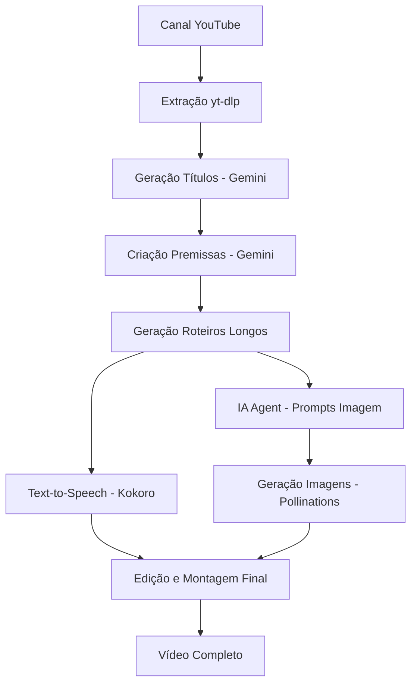

# 🎬 Pipeline de Automação Completa - Especificações Técnicas

## 1. Visão Geral do Sistema

### 1.1 Objetivo

Implementar um pipeline totalmente automatizado que transforma um canal do YouTube em vídeos completos prontos para publicação, sem intervenção manual.

### 1.2 Fluxo Completo

```
Canal YouTube → Extração → Títulos → Premissas → Roteiros → TTS → Imagens → Vídeo Final
```

## 2. Arquitetura do Pipeline

### 2.1 Diagrama de Fluxo



### 2.2 Tecnologias por Etapa

| Etapa             | Tecnologia    | Provider  | Configuração         |
| ----------------- | ------------- | --------- | -------------------- |
| Extração YouTube  | yt-dlp        | Local     | Método preferencial  |
| Geração Títulos   | Gemini        | Google AI | Prompt personalizado |
| Criação Premissas | Gemini        | Google AI | Prompt personalizado |
| Roteiros Longos   | Sistema Atual | Múltiplos | Gerador existente    |
| Text-to-Speech    | Kokoro        | Local/API | Voz natural          |
| IA Agent Imagens  | Gemini        | Google AI | Análise de roteiro   |
| Geração Imagens   | Pollinations  | API       | Gratuito             |
| Edição Vídeo      | MoviePy       | Local     | Python               |

## 3. Especificações Técnicas Detalhadas

### 3.1 Etapa 1: Extração YouTube (yt-dlp)

**Endpoint:** `POST /api/pipeline/extract-youtube`

**Configuração:**

```json
{
  "method": "ytdlp",
  "max_titles": 10,
  "min_views": 1000,
  "days": 30,
  "extract_metadata": true
}
```

**Output:**

```json
{
  "success": true,
  "data": {
    "videos": [
      {
        "title": "Título original",
        "views": 50000,
        "duration": "10:30",
        "description": "Descrição...",
        "thumbnail": "url"
      }
    ],
    "channel_info": {
      "name": "Nome do Canal",
      "subscribers": 100000
    }
  }
}
```

### 3.2 Etapa 2: Geração de Títulos (Gemini + Prompt Personalizado)

**Endpoint:** `POST /api/pipeline/generate-titles`

**Prompt Personalizado:**

```
Você é um especialista em criação de títulos virais para YouTube. 
Analise os títulos originais e crie 5 versões otimizadas que:
- Aumentem o CTR (Click-Through Rate)
- Mantenham a essência do conteúdo
- Usem gatilhos emocionais
- Sejam adequados ao nicho

Títulos originais: {original_titles}
Nicho detectado: {detected_niche}

Formato de resposta:
1. [Título otimizado 1]
2. [Título otimizado 2]
...
```

**Configuração:**

```json
{
  "provider": "gemini",
  "model": "gemini-1.5-flash",
  "custom_prompt": true,
  "titles_count": 5,
  "optimize_for": "viral"
}
```

### 3.3 Etapa 3: Criação de Premissas (Gemini + Prompt Personalizado)

**Endpoint:** `POST /api/pipeline/generate-premises`

**Prompt Personalizado:**

```
Você é um roteirista profissional especializado em storytelling para vídeos.
Crie premissas envolventes baseadas nos títulos otimizados.

Cada premissa deve:
- Ter 150-250 palavras
- Incluir gancho inicial forte
- Desenvolver conflito/problema
- Sugerir resolução
- Manter tom adequado ao nicho

Títulos: {optimized_titles}
Contexto do canal: {channel_context}

Formato:
**TÍTULO:** [título]
**PREMISSA:** [premissa detalhada]
---
```

### 3.4 Etapa 4: Geração de Roteiros Longos (Sistema Atual)

**Endpoint:** `POST /api/pipeline/generate-long-scripts`

**Integração:** Usar o sistema existente de geração de roteiros longos

**Configuração:**

```json
{
  "chapters": 8,
  "style": "storytelling",
  "duration_target": "10-15min",
  "include_hooks": true,
  "call_to_action": true
}
```

### 3.5 Etapa 5: Text-to-Speech (Kokoro)

**Endpoint:** `POST /api/pipeline/generate-tts-kokoro`

**Especificações Kokoro:**

```json
{
  "provider": "kokoro",
  "voice": "natural_pt_br",
  "speed": 1.0,
  "pitch": 0,
  "emotion": "neutral",
  "segment_audio": true,
  "max_segment_length": 1000
}
```

**Processamento:**

* Segmentar roteiro por capítulos

* Gerar áudio para cada segmento

* Concatenar com transições suaves

* Exportar em alta qualidade (192kbps)

### 3.6 Etapa 6: IA Agent para Prompts de Imagem (Gemini)

**Endpoint:** `POST /api/pipeline/generate-image-prompts`

**Prompt do Agent:**

```
Você é um especialista em criação de prompts para geração de imagens.
Analise o roteiro e crie prompts detalhados para cada capítulo.

Cada prompt deve:
- Ser específico e descritivo
- Incluir estilo visual adequado
- Considerar composição e cores
- Ser otimizado para Pollinations AI
- Manter consistência visual

Roteiro: {script_content}
Estilo desejado: {visual_style}
Tom do vídeo: {video_tone}

Formato:
**CAPÍTULO 1:** [prompt detalhado]
**CAPÍTULO 2:** [prompt detalhado]
...
```

**Output:**

```json
{
  "image_prompts": [
    {
      "chapter": 1,
      "prompt": "Detailed prompt for chapter 1",
      "style": "cinematic",
      "duration": 30
    }
  ]
}
```

### 3.7 Etapa 7: Geração de Imagens (Pollinations)

**Endpoint:** `POST /api/pipeline/generate-images`

**Configuração Pollinations:**

```json
{
  "provider": "pollinations",
  "model": "flux",
  "resolution": "1920x1080",
  "quality": "high",
  "batch_size": 4,
  "style_consistency": true
}
```

**Processamento:**

* Gerar imagens para cada capítulo

* Aplicar filtros de consistência

* Redimensionar para formato vídeo

* Salvar em alta resolução

### 3.8 Etapa 8: Edição e Montagem Final (MoviePy)

**Endpoint:** `POST /api/pipeline/create-final-video`

**Especificações de Vídeo:**

```json
{
  "resolution": "1920x1080",
  "fps": 30,
  "codec": "libx264",
  "audio_codec": "aac",
  "bitrate": "5000k",
  "audio_bitrate": "192k"
}
```

**Processo de Edição:**

1. Sincronizar áudio com imagens
2. Aplicar transições entre capítulos
3. Adicionar fade in/out
4. Inserir texto/legendas (opcional)
5. Renderizar vídeo final
6. Gerar thumbnail automático

## 4. Estrutura de Endpoints

### 4.1 Endpoint Principal

**`POST /api/pipeline/complete-automation`**

**Request:**

```json
{
  "channel_url": "https://youtube.com/@canal",
  "config": {
    "extraction": {
      "method": "ytdlp",
      "max_titles": 10,
      "min_views": 1000
    },
    "titles": {
      "provider": "gemini",
      "custom_prompt": true,
      "count": 5
    },
    "premises": {
      "provider": "gemini",
      "custom_prompt": true
    },
    "scripts": {
      "chapters": 8,
      "style": "storytelling"
    },
    "tts": {
      "provider": "kokoro",
      "voice": "natural_pt_br"
    },
    "images": {
      "provider": "pollinations",
      "style": "cinematic"
    },
    "video": {
      "resolution": "1920x1080",
      "quality": "high"
    }
  },
  "api_keys": {
    "gemini": "key",
    "kokoro": "key"
  }
}
```

**Response:**

```json
{
  "success": true,
  "pipeline_id": "uuid",
  "status": "processing",
  "estimated_time": "15-20 minutes",
  "steps": [
    {
      "step": "extraction",
      "status": "completed",
      "duration": "30s"
    },
    {
      "step": "titles",
      "status": "processing",
      "progress": 60
    }
  ]
}
```

### 4.2 Endpoints de Monitoramento

**`GET /api/pipeline/status/{pipeline_id}`** - Status em tempo real
**`GET /api/pipeline/logs/{pipeline_id}`** - Logs detalhados
**`POST /api/pipeline/pause/{pipeline_id}`** - Pausar pipeline
**`POST /api/pipeline/cancel/{pipeline_id}`** - Cancelar pipeline

## 5. Estrutura de Dados

### 5.1 Pipeline State

```json
{
  "pipeline_id": "uuid",
  "status": "processing|completed|failed|paused",
  "current_step": "extraction|titles|premises|scripts|tts|images|video",
  "progress": 45,
  "started_at": "2024-01-01T10:00:00Z",
  "estimated_completion": "2024-01-01T10:20:00Z",
  "results": {
    "extraction": {...},
    "titles": {...},
    "premises": {...},
    "scripts": {...},
    "tts": {...},
    "images": {...},
    "video": {
      "file_path": "/path/to/video.mp4",
      "thumbnail": "/path/to/thumb.jpg",
      "duration": "12:34",
      "size": "150MB"
    }
  },
  "errors": [],
  "warnings": []
}
```

## 6. Interface do Usuário

### 6.1 Página Pipeline Aprimorada

**Localização:** `frontend/src/pages/Pipeline.jsx`

**Seções:**

1. **Automação Completa** (Nova)

   * Input: URL do canal

   * Configurações avançadas

   * Botão "Criar Vídeo Automaticamente"

   * Progress bar em tempo real

2. **Pipelines Manuais** (Existente)

   * Controle individual de etapas

3. **Monitoramento** (Existente)

   * Status de pipelines ativos

### 6.2 Componentes Necessários

**`AutomationCompleteForm.jsx`**

```jsx
- Canal input
- Configurações por etapa
- Preview de configuração
- Validação de APIs
```

**`PipelineProgress.jsx`**

```jsx
- Progress bar detalhado
- Status de cada etapa
- Logs em tempo real
- Controles (pause/cancel)
```

**`VideoPreview.jsx`**

```jsx
- Player de vídeo
- Informações do vídeo
- Download/compartilhamento
- Métricas de qualidade
```

## 7. Considerações de Performance

### 7.1 Otimizações

* **Processamento paralelo** para imagens

* **Cache inteligente** para prompts similares

* **Compressão progressiva** de vídeo

* **Cleanup automático** de arquivos temporários

### 7.2 Recursos Necessários

* **CPU:** Processamento de vídeo intensivo

* **RAM:** 8GB+ recomendado

* **Storage:** 5GB+ por vídeo (temporário)

* **Bandwidth:** APIs externas

## 8. Tratamento de Erros

### 8.1 Estratégias de Fallback

* **Extração:** yt-dlp → YouTube API → RapidAPI

* **IA:** Gemini → OpenAI → Claude

* **TTS:** Kokoro → ElevenLabs → Google TTS

* **Imagens:** Pollinations → Together.ai → DALL-E

### 8.2 Recovery Points

* Salvar estado após cada etapa

* Permitir restart de etapa específica

* Backup de arquivos intermediários

## 9. Segurança e Compliance

### 9.1 APIs Keys

* Armazenamento seguro

* Rotação automática

* Rate limiting

### 9.2 Conteúdo

* Filtros de conteúdo inadequado

* Verificação de direitos autorais

* Compliance com ToS das plataformas

## 10. Métricas e Analytics

### 10.1 KPIs do Pipeline

* Tempo médio de processamento

* Taxa de sucesso por etapa

* Qualidade dos outputs

* Uso de recursos

### 10.2 Dashboard de Métricas

* Gráficos de performance

* Histórico de pipelines

* Análise de custos

* Relatórios de qualidade

## 11. Roadmap de Implementação

### 11.1 Fase 1: Backend Core (Semana 1)

* [ ] Estrutura do pipeline principal

* [ ] Integração Kokoro TTS

* [ ] IA Agent para prompts de imagem

* [ ] Sistema de monitoramento

### 11.2 Fase 2: Frontend Interface (Semana 2)

* [ ] Página Pipeline aprimorada

* [ ] Componentes de automação

* [ ] Progress tracking

* [ ] Preview de result

